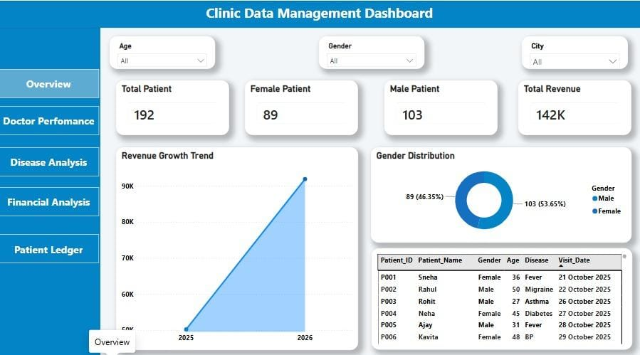
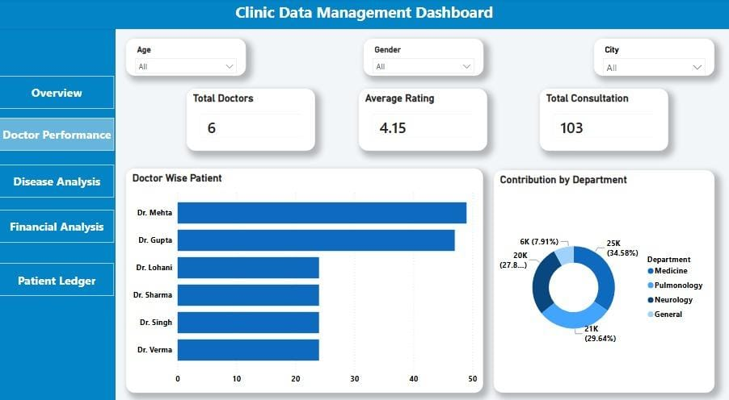
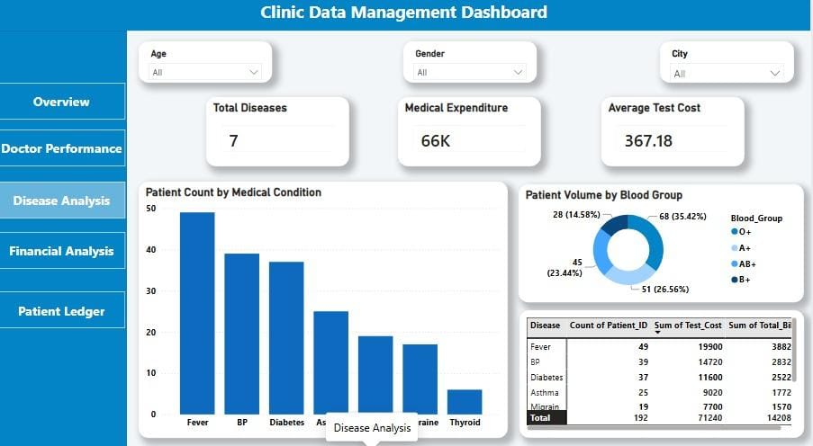
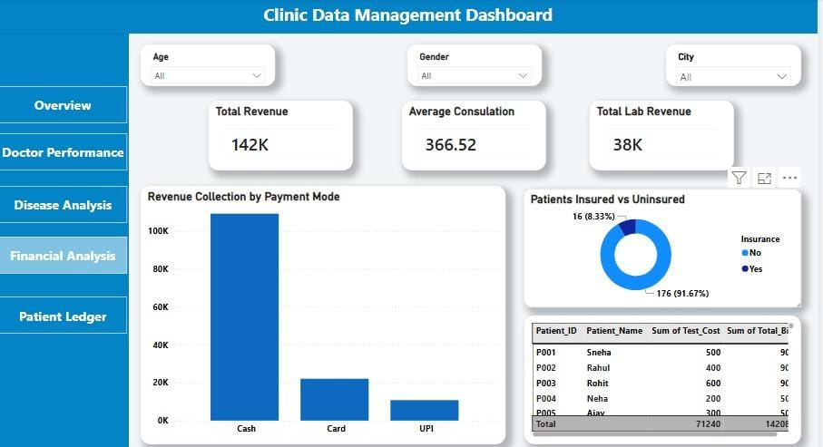
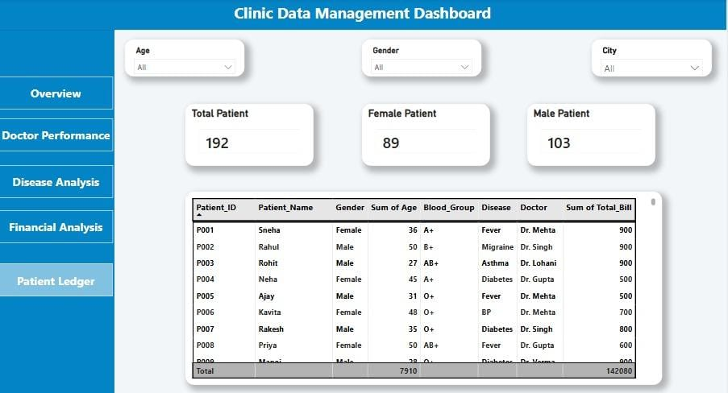

#  Clinic Data Management and Analytics Project

## Project Components and Files Included
* Clinic_Management_Data.xlsx: Excel workbook containing three primary stages (Raw_Data, Cleaned_Data, and Analysis with summary tables and pivot charts).
* Clinic-Data-Management-Dashboard.pbix: Fully interactive 5-page Power BI dashboard designed for clinic stakeholders.
* Clinic_Analysis_Presentation.pdf: A comprehensive slide deck summarizing core operational and financial insights page-by-page.

## Executive Summary and Key Insights

### Page 1: Overview Dashboard
* Total Patients and Capacity: Successfully tracked overall clinic operations handling 192 total patients and securing a total revenue of $142K.
* Demographic Analysis: Analyzed general patient distribution, revealing 103 Male patients and 89 Female patients.
* Revenue Growth: Implemented an Area Chart to track real-time revenue collection trends and identify peak healthcare operational seasons.

### Page 2: Doctor Performance Analysis
* Workload Management: Evaluated cumulative consultation metrics across 7 specialized doctors to optimize resources.
* Quality Metrics: Monitored average patient satisfaction metrics, establishing an impressive doctor rating of 4.15/5.
* Doctor Volume: Used Clustered Bar Charts to identify the highest revenue and patient-generating medical professionals.

### Page 3: Disease and Patient Profiling
* Condition Volume: Audited case counts for prominent medical conditions including Fever, Migraine, and Asthma.
* Blood Group Grid: Leveraged a Donut Chart to map patient records across vital blood groups for emergency healthcare planning.
* Expenditure vs. Count: Combined diagnostic metrics to discover financial overheads per specialized disease treatment.

### Page 4: Financial and Billing Analysis
* Payment Channels: Examined revenue collection models, highlighting Cash as the dominant transaction mode over Digital UPI and Cards.
* Insurance Auditing: Analyzed the operational split between Insured vs. Uninsured patients to assess billing default risks and coverage accessibility.

### Page 5: Patient Ledger (Master Record Grid)
* Granular Table: Designed a 100% full-width structured grid for internal managers to search and audit detailed patient logs line-by-line.
* Consolidated Logs: Seamlessly binds unique identifiers like Patient ID, Age, Disease, Assigned Doctor, and individual billing.
##  Complete Dashboard Interface (All Pages in Order)

###  Page 1: Overview

###  Page 2: Doctor Performance

###  Page 3: Disease Analysis

###  Page 4: Financial Analytics

###  Page 5: Patient Ledger

